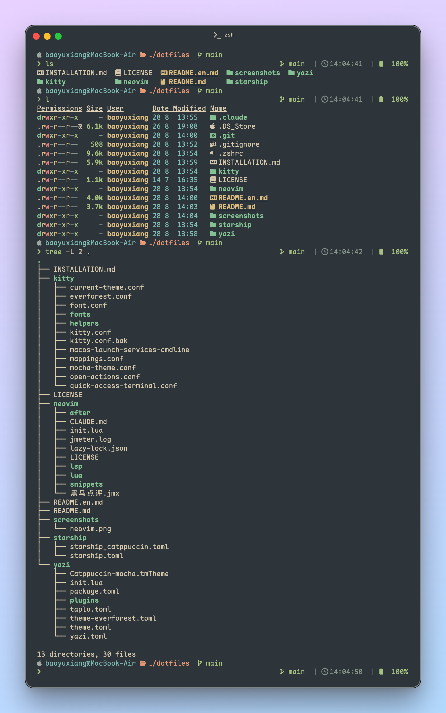

# 💻 dotfiles

> _我的个人 dotfiles 配置集合，包含 Neovim、Kitty、Starship、Neofetch、Fastfetch 等开发环境配置_

<div align="center">

[](https://opensource.org/licenses/MIT)
[](https://www.apple.com/macos/)
[](https://neovim.io/)
[](https://sw.kovidgoyal.net/kitty/)
[](https://starship.rs/)
[](https://github.com/dylanaraps/neofetch)
[](https://github.com/fastfetch-cli/fastfetch)

[🇨🇳 中文版本](README.md) | [🇺🇸 English Version](README.en.md)

</div>


## 🚀 特性

- **🎨 现代化 Neovim 配置** - 基于 Lua，使用 lazy.nvim 插件管理器
- **🌲 Everforest 主题** - 统一的视觉体验，护眼的绿色主题
- **🔧 完整的 LSP 支持** - Python、Lua、Rust、Go、TypeScript 等语言
- **📝 代码片段** - 支持多种语言的智能代码片段
- **🖥️ 终端配置** - Kitty 终端与 Starship 提示符
- **📊 系统信息** - Neofetch 和 Fastfetch 系统信息显示
- **🎯 模块化设计** - 易于维护和扩展的配置结构

## 📁 配置概览

### Neovim ([`./neovim/`](./neovim/))
- **插件管理**: lazy.nvim 自动管理插件
- **LSP 支持**: Python (pylsp + ruff)、Lua、Rust、Go、TS/JS 等
- **代码格式化**: conform.nvim 统一代码格式化
- **调试功能**: nvim-dap 调试器支持
- **任务管理**: overseer.nvim 任务运行器
- **文件浏览**: oil.nvim 现代文件管理器
- **主题**: Everforest、Catppuccin、Nord 等主题

### Kitty ([`./kitty/`](./kitty/))
- **主题配置**: Everforest、Mocha 等主题
- **字体支持**: 多种 Nerd Font 字体配置
- **性能优化**: 背景模糊、透明度等视觉效果
- **快捷键**: 高效的键盘映射和操作

### Starship ([`./starship/`](./starship/))
- **提示符定制**: 优雅的命令行提示符
- **主题配色**: Everforest 配色方案
- **信息显示**: Git、Python、Node.js、Rust 等环境信息

### Yazi ([`./yazi/`](./yazi/))
- **文件管理**: 现代化的终端文件管理器
- **主题配置**: Everforest、Catppuccin 等主题
- **插件支持**: parent-arrow、smart-enter、starship 等插件
- **快捷键**: 高效的文件操作快捷键

### Neofetch ([`./neofetch/`](./neofetch/))
- **系统信息**: 显示操作系统、硬件、内核等信息
- **Apple 专用**: config-apple.conf 专门针对 macOS 的配置
- **自定义 logo**: 包含 Catppuccin 主题的 Apple logo

### Fastfetch ([`./fastfetch/`](./fastfetch/))
- **高性能**: 比 Neofetch 更快的系统信息显示
- **JSON 配置**: 使用 JSONC 格式的配置文件
- **自定义 ASCII**: 包含自定义 ASCII 艺术显示

### FZF
- **模糊查找**: 命令行模糊查找工具
- **快捷键绑定**: 与 shell 集成的快捷操作

## 🛠️ 安装使用

### 克隆仓库
```bash
git clone https://github.com/ethanbao27/dotfiles.git ~/dotfiles
cd ~/dotfiles
```

### 创建符号链接
```bash
# Neovim
ln -s ~/dotfiles/neovim ~/.config/nvim

# Kitty
ln -s ~/dotfiles/kitty ~/.config/kitty

# Starship
ln -s ~/dotfiles/starship/starship.toml ~/.config/starship.toml

# Yazi
ln -s ~/dotfiles/yazi ~/.config/yazi

# Neofetch
ln -s ~/dotfiles/neofetch ~/.config/neofetch

# Fastfetch
ln -s ~/dotfiles/fastfetch ~/.config/fastfetch
```

### 安装依赖
```bash
# Neovim 插件
nvim --headless "+Lazy sync" +qa

# Kitty 字体 (如需要)
# 在 ~/.config/kitty/kitty.conf 中选择喜欢的字体
```

## 📸 预览

### Kitty 界面


## 🎨 主题

当前使用 **Everforest** 主题，提供舒适的绿色护眼体验。支持的主题包括：
- Everforest (默认)
- Catppuccin
- Nord
- Mocha

## 📖 安装指南

详细的安装说明请查看 [安装指南](INSTALLATION.md)。

## 🤝 致谢

特别感谢 [patricorgi's config](https://github.com/patricorgi/dotfiles) 提供的 Neovim 配置灵感。

## 📄 许可证

本项目采用 [MIT 许可证](LICENSE) - 详见 [LICENSE](LICENSE) 文件。

---

<div align="center">
Made with ❤️ by <a href="https://github.com/ethanbao27">baoyuxiang</a>
</div>
